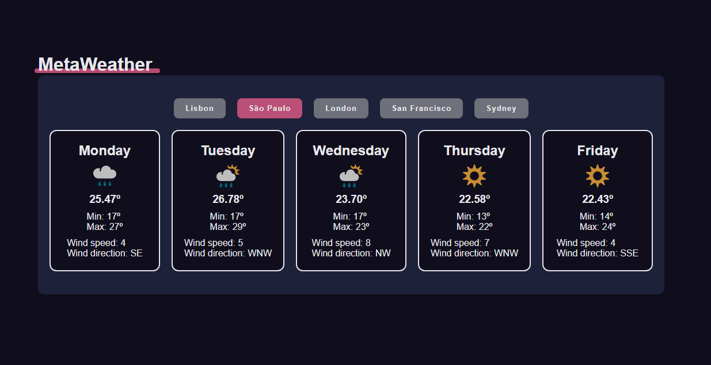

<h1 align="center">
  MetaWeather - Next 5 Days Forecast
</h1>

<p align="center">
  
  
  
  
  

  <a href="https://github.com/humbruno/metaweather-api/commits/master">
    
  </a>
  
  <a href="https://github.com/humbruno/metaweather-api/issues">
    
  </a>
</p>

<p align="center">
  
</p>

## 💻 Project

Lorem, ipsum dolor sit amet consectetur adipisicing elit. Necessitatibus ipsam provident iusto aut a earum ad vero dolor veritatis consectetur.
Lorem, ipsum dolor sit amet consectetur adipisicing elit. Necessitatibus ipsam provident iusto aut a earum ad vero dolor veritatis consectetur.
Lorem, ipsum dolor sit amet consectetur adipisicing elit. Necessitatibus ipsam provident iusto aut a earum ad vero dolor veritatis consectetur.

Dependencies used for this project:

- [React](https://reactjs.org/)
- [Styled Components](https://styled-components.com/)
- [Axios](https://github.com/axios/axios)
- [MetaWeather API](https://www.metaweather.com/api/)

## 🔌 Live Website Link

- [Live Website](https://weather.brunosantos.dev/)

## 📥 Installing and executing

Clone this repository and access the directory.

```bash
# Instaling dependencies
$ npm install

# Executing the application
$ npm start
```
